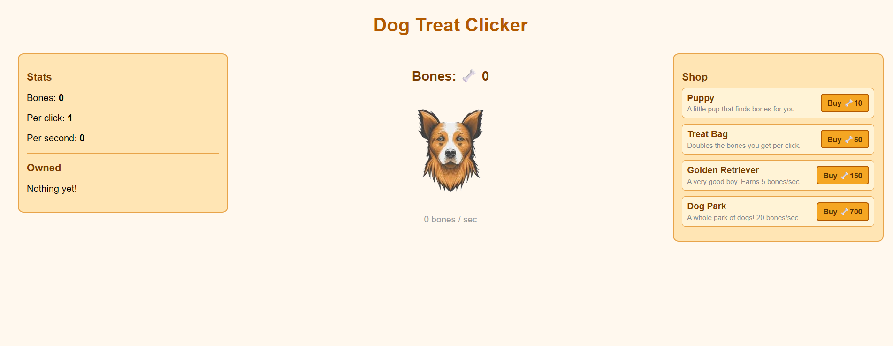

# clicker-stock
 This is a basic dog treat website made using html , css and javascript.

 # Preview  

# demo
check demo here : "https://clicker-stock.vercel.app/"

# Tech Stack
1. Html
2. Css
3. javascript

# Local Installation 

1. Clone the repository git clone https://github.com/elitepunith/clicker-stock

2. Navigate into the project directory cd clicker-stock

3. Open index.html in your browser to view the site